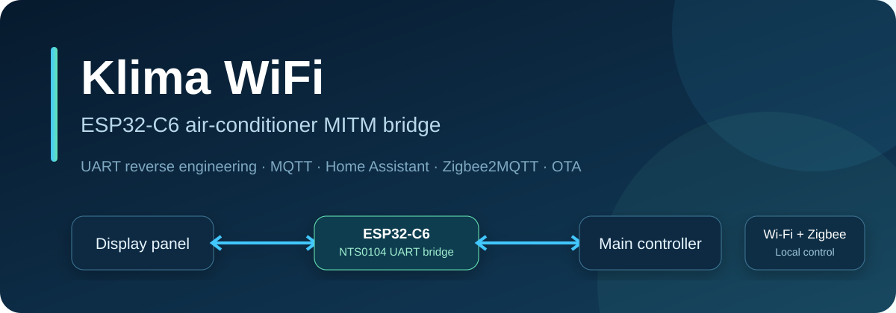
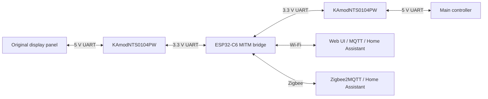

# LIN TAC09CPBPSL Wi-Fi & Zigbee Control with ESP32-C6



[](https://github.com/mateuszsury/lin-tac09cpbpsl-esp32c6-wifi-zigbee/actions/workflows/ci.yml)
[](LICENSE)
[](https://github.com/espressif/esp-idf/releases/tag/v5.3.2)
[](https://www.espressif.com/en/products/socs/esp32-c6)
[](docs/HOME_ASSISTANT.md)
[](zigbee2mqtt/klima_wifi_converter.js)

Add local Wi-Fi, MQTT, Home Assistant and Zigbee2MQTT control to the black LIN
TAC09CPBPSL compact portable air conditioner without removing its original
panel. Klima WiFi places an ESP32-C6 between the display and main controller,
forwards their proprietary UART traffic in both directions, decodes the
appliance state, and injects response-confirmed commands.

The firmware provides a local web UI, OTA updates, MQTT Discovery for Home
Assistant, and a Zigbee2MQTT build. It does not require a vendor cloud account.

> [!WARNING]
> This project connects to a mains-powered appliance. Work only on the isolated
> low-voltage interface and never change wiring while the appliance is powered.
> Read [the hardware safety section](docs/HARDWARE.md#safety-boundary) first.

## Confirmed compatibility

The protocol and active bridge were validated on this exact OEM board pair:

| Part | Identifier |
|---|---|
| Air conditioner | LIN TAC09CPBPSL, black compact portable model |
| Display PCB | `TD-YD-PSL-XS V1.0` / `810901115C` |
| Main controller | `810901123B`, variant `D10B` |
| Protocol | `TD` UART, 9600 baud, 8N1 |
| Level translator | KAmodNTS0104PW / NTS0104 |
| Controller | ESP32-C6 |

The complete implementation was tested on the LIN TAC09CPBPSL. The same boards
appear in selected TCL, iFFALCON, Equation and related OEM portable air
conditioners, but a matching case or similar model name does not prove protocol
compatibility. Verify the PCB identifiers, voltages and frame format before
enabling an active profile.

Polish retail name: **Klimatyzator Kompakt LIN Czarny TAC09CPBPSL**.

## What it controls

- power on and off;
- target temperature from 18 to 32 degrees Celsius;
- Cool, Fan-only and Dry modes;
- Low and High fan speeds;
- Quiet mode;
- Celsius or Fahrenheit display units;
- original panel and remote-control actions with physical-control priority.

Timer state is readable. Timer duration, Sleep and Swing are not decoded and
remain intentionally unavailable for remote writes.

## Integrations

- local web dashboard and JSON API;
- authenticated HTTP control and browser-based OTA;
- MQTT state, commands, availability and Home Assistant Discovery;
- non-optimistic Home Assistant Climate entity;
- Zigbee End Device firmware with Thermostat, Fan Control and diagnostic
  attributes;
- Zigbee2MQTT external converter;
- timestamped logs, frame captures and protocol counters.

Both MQTT and Zigbee2MQTT control paths have been tested on the appliance. Each
remote command waits for a matching reply from the main controller before the
reported state changes.

## Architecture



The four NTS0104 channels are on one physical module. They are shown twice in
the diagram to make each communication direction clear.

## Wiring summary

There are no bypass jumpers in normal operation.

| Signal | KAmod path | ESP32-C6 |
|---|---|---|
| Main TX to ESP RX | B1 to A1 | GPIO4 |
| ESP TX to panel RX | A2 to B2 | GPIO6 |
| Panel TX to ESP RX | B3 to A3 | GPIO7 |
| ESP TX to main RX | A4 to B4 | GPIO0 |
| Translator enable | OE | GPIO3 and external 10 kOhm pull-down |

`VDD(A)` is 3.3 V. `VDD(B)` uses the panel's regulated 5 V rail. Both KAmod
ground pins connect to the common signal ground. There is no ADC divider or
voltage-sensing circuit. Follow the [complete wiring guide](docs/HARDWARE.md)
before applying power.

## Quick start

1. Install ESP-IDF 5.3.2 and clone this repository.
2. Copy `main/klima_secrets.example.h` to the ignored
   `main/klima_secrets_local.h`.
3. Enter unique Wi-Fi, device-token and optional MQTT credentials.
4. Build and flash the RX-only `SNIFFER` profile.
5. Confirm valid frames from both UART directions with no protocol errors.
6. Move to `BRIDGE`, then `MITM_NTS`, only after the final wiring passes every
   gate in [docs/VALIDATION.md](docs/VALIDATION.md).

Windows and WSL example:

```powershell
git clone https://github.com/mateuszsury/lin-tac09cpbpsl-esp32c6-wifi-zigbee.git
Set-Location lin-tac09cpbpsl-esp32c6-wifi-zigbee
$env:KLIMA_WSL_IDF_EXPORT = '/home/<user>/esp/esp-idf/export.sh'
Copy-Item main\klima_secrets.example.h main\klima_secrets_local.h
.\tools\build_profiles.ps1 -Profile SNIFFER -Transport MQTT -Clean -Manifest
.\tools\flash_profile.ps1 -Profile SNIFFER -Transport MQTT -Port <PORT>
```

Continue with [installation, configuration, flashing and recovery](docs/INSTALLATION.md).

## Firmware profiles

| Profile | Translator OE | Forwarding | External control | Use |
|---|---:|---:|---:|---|
| `SNIFFER` | low | no | no | first boot, capture and recovery |
| `PASSIVE` | low | no | no | compatibility alias for `SNIFFER` |
| `PANEL_DIAG` | high | no TX | no | detached-panel receive test |
| `PANEL_BENCH` | high | panel emulator only | no | detached-panel development |
| `BRIDGE` | high | yes | no | transparent forwarding test |
| `MITM_NTS` | high | yes | yes | verified final topology |

MQTT and Zigbee are separate build transports. `MITM_NTS` is never selected
implicitly, and the flash helper requires `-ForceActive`.

## Documentation

- [Hardware, pinout and electrical checks](docs/HARDWARE.md)
- [Installation, configuration, flash, OTA and recovery](docs/INSTALLATION.md)
- [Decoded UART protocol and capture rules](docs/PROTOCOL.md)
- [Home Assistant MQTT and Zigbee2MQTT setup](docs/HOME_ASSISTANT.md)
- [Tests, build matrix and HIL evidence](docs/VALIDATION.md)
- [Security policy](SECURITY.md)
- [Support](SUPPORT.md) and [contribution guide](CONTRIBUTING.md)

## Development checks

```powershell
py -3 -m pytest -q tests
node --check zigbee2mqtt\klima_wifi_converter.js
```

CI builds `SNIFFER`, `BRIDGE` and `MITM_NTS` for MQTT and Zigbee with ESP-IDF
5.3.2. Software checks do not replace electrical tests on the target hardware.

## License and acknowledgements

Project code is licensed under the [MIT License](LICENSE). Build dependencies
retain their own licenses; see [THIRD_PARTY_NOTICES.md](THIRD_PARTY_NOTICES.md).
Project and ecosystem acknowledgements are listed in
[ACKNOWLEDGEMENTS.md](ACKNOWLEDGEMENTS.md).

ESP32, Home Assistant, Zigbee2MQTT, TCL and all other product names are
trademarks of their respective owners. This independent project is not
affiliated with or endorsed by those owners.
